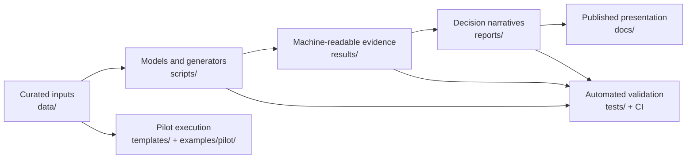

# AI Coding-Agent Orchestrator Evaluation

A reproducible decision-support repository for comparing permissively licensed AI coding-agent orchestrators. It combines source-backed scoring, uncertainty analysis, sandbox and security evaluation, operational modeling, and a controlled pilot protocol so teams can move from a broad market scan to an evidence-based adoption decision.

> [!IMPORTANT]
> This repository is a screening and decision framework, not a live head-to-head benchmark of every candidate. Use it to build a shortlist, then validate that shortlist with representative pilot tasks before production adoption.

## Start Here

| Goal | Recommended entry point |
|---|---|
| Understand the conclusion quickly | [Executive brief](reports/executive_brief.md) |
| Read the primary narrative | [Final global report](reports/final_global_report.md) |
| Audit the detailed evaluation | [Technical evaluation](reports/ai_orchestrator_frameworks_report.md) |
| Navigate every report and artifact | [Report library](reports/README.md) |
| Review quality and reproducibility | [Validation summary](reports/validation_summary.md) |
| Open the static web version | [GitHub Pages source](docs/index.html) |

The three main reports have distinct roles:

- `reports/final_global_report.md` is the primary overview and decision narrative.
- `reports/ai_orchestrator_frameworks_report.md` is the detailed technical evaluation.
- `reports/final_report_bundle.md` is a generated, single-file compilation for offline review.

## Evaluation at a Glance

| Dimension | Coverage |
|---|---|
| Candidate set | 17 permissively licensed alternatives and 2 documented exclusions |
| Decision scenarios | Custom orchestrator, secure autonomous pull requests, local coding, research benchmarking, and enterprise control plane |
| Scoring model | 14 calibrated criteria on a 0–5 scale |
| Quantitative analysis | Deterministic ranking, Monte Carlo simulation, sensitivity analysis, regret, Pareto, and stress testing |
| Operational analysis | Implementation effort, operating cost, latency risk, and operation-adjusted fit |
| Security analysis | Sandbox comparison, threat coverage, risk register, and reusable security fixtures |
| Adoption evidence | 20-task pilot suite, reviewer scorecard, security gates, and post-pilot scoring model |

## Key Finding

There is no universal winner. The appropriate shortlist changes with the operating scenario and the level of autonomy, governance, and integration required.

| Scenario | Primary shortlist | Decision emphasis |
|---|---|---|
| Custom orchestrator | OpenHands SDK, Deep Agents, Cline SDK | Programmability, provider flexibility, and platform ownership |
| Secure autonomous pull requests | Codex CLI, OpenHands SDK, Cline SDK | Isolation, approvals, secrets, and traceability |
| Quick local coding | Cline, OpenCode, Aider, Codex CLI | Adoption speed, developer control, and provider choice |
| Research benchmarking | mini-SWE-agent, SWE-agent, OpenHands SDK | Reproducibility, ablations, and issue-resolution rigor |
| Enterprise control plane | Cline, OpenHands SDK, OpenHands Agent Canvas, Open SWE | Multi-team governance, observability, and operating burden |

Across scenarios, OpenHands SDK is the most stable general platform candidate, while Cline is especially strong in workflow-centered scenarios. The authoritative rationale and caveats are in the [recommendation report](reports/recommendation_rationale.md).

## How the Repository Works



The repository separates source material from generated evidence:

- Curated inputs live in `data/`, including the source bibliography in `data/sources/`.
- Reproducible scripts transform those inputs into CSV, JSON, Markdown, and SVG artifacts.
- Generated machine-readable outputs live in `results/` and should not be edited manually.
- Authored and generated reports live in `reports/`; the [report library](reports/README.md) labels their roles.
- `docs/assets/` is the single canonical location for rendered charts and diagram assets used by the site and Markdown reports.

## Repository Structure

| Path | Responsibility |
|---|---|
| `.github/` | Active GitHub Actions validation plus Copilot agent and extension configuration |
| `data/` | Versioned candidate data, scoring models, risk inputs, pilot definitions, and curated sources |
| `docs/` | Static GitHub Pages site, canonical SVG/CSS assets, and Mermaid diagram sources |
| `examples/pilot/` | Custom-weight input, pilot summary input, and the minimal Python adapter contract |
| `examples/copilot-sdk-dynamic-agents/` | Executable Node.js proof of concept for runtime-created GitHub Copilot agents and skills |
| `reports/` | Decision documents, methodology, appendices, generated reports, and the report index |
| `results/` | Reproducible generated CSV and JSON outputs |
| `scripts/` | Simulation, analysis, generation, live-source checks, and validation entry points |
| `templates/` | Pilot logs, scorecards, security gates, and scenario-selection worksheets |
| `tests/` | Python unit and artifact-contract tests |

## Quick Start

### Requirements

- Python 3.12 or newer for the core evaluation workflow.
- Git for reviewing generated changes.
- PowerShell only if you want to use the optional Windows wrapper.
- Node.js `^20.19.0` or `>=22.12.0` only for the Copilot SDK proof of concept.

The Python workflow uses only the standard library; no package installation is required.

### Run the Complete Offline Workflow

```powershell
python scripts/run_all_checks.py
```

The command runs the unit tests, English-content check, simulations, report generators, schema checks, reference checks, Markdown checks, artifact manifest, and final offline validation. It intentionally regenerates committed artifacts, so review the resulting Git diff.

On Windows, the equivalent wrapper is:

```powershell
.\scripts\run_all_checks.ps1
```

### Run Read-Only Checks First

```powershell
python -m unittest discover -s tests
python scripts/check_english_content.py
git diff --check
```

## Validation and CI

| Validation layer | Command or location | Network required |
|---|---|---:|
| Unit and contract tests | `python -m unittest discover -s tests` | No |
| English-only repository content | `python scripts/check_english_content.py` | No |
| Full regeneration and validation | `python scripts/run_all_checks.py` | No |
| Local artifact references | `python scripts/check_local_artifact_references.py` | No |
| Markdown table consistency | `python scripts/validate_markdown_tables.py` | No |
| Generated CSV contracts | `python scripts/validate_csv_schemas.py` | No |
| Offline artifact integrity | `python scripts/validate_artifacts.py` | No |
| External source availability | `python scripts/check_sources.py --timeout 20` | Yes |
| Current GitHub metadata | `python scripts/refresh_github_metadata.py --timeout 20` | Yes |
| Continuous integration | `.github/workflows/validate.yml` | Managed by GitHub Actions |

CI runs the complete Python workflow, verifies that generated artifacts are committed, and separately tests the Copilot SDK proof of concept.

## Customize the Decision Model

### Use Custom Scenario Weights

Edit `examples/pilot/custom_weights.example.json`, then run:

```powershell
python scripts/rank_with_custom_weights.py --weights examples/pilot/custom_weights.example.json --output results/custom_weights_example_rankings.csv
```

The input must define every criterion used by the scoring model. See the [methodology appendix](reports/methodology_appendix.md) for normalization and scoring details.

### Move from Screening to Pilot Evidence

1. Select the target scenario with `templates/scenario_selection_workshop.md`.
2. Choose a comparable shortlist from `reports/recommendation_rationale.md`.
3. Run representative tasks from `data/pilot_tasks.json` through adapters shaped like `examples/pilot/adapter.py`.
4. Capture execution metrics in `templates/pilot_run_log.csv`.
5. Review patches with `templates/reviewer_scorecard.md` and `templates/security_gate_checklist.md`.
6. Summarize each candidate using `examples/pilot/candidate_summary.example.csv`.
7. Produce the post-pilot ranking:

```powershell
python scripts/score_pilot_results.py --input examples/pilot/candidate_summary.example.csv --output results/pilot_decision_scores.example.csv
```

The detailed execution and decision rules are in the [pilot protocol](reports/pilot_protocol.md).

## Copilot SDK Dynamic-Agent Proof of Concept

The repository includes a separate Node.js example that creates agents dynamically, assigns different skills, enforces per-step permission boundaries, chains the agents, and records sanitized acceptance evidence.

```powershell
cd examples/copilot-sdk-dynamic-agents
npm ci
npm test
npm run validate
```

Authenticated smoke tests are documented in the [POC guide](examples/copilot-sdk-dynamic-agents/README.md). They are intentionally separate from the offline repository workflow because they require GitHub Copilot access.

## Maintenance

When source data, criteria, scenarios, or report content changes:

1. Update the authoritative input or authored report.
2. Run `python scripts/run_all_checks.py`.
3. Inspect generated changes for unexpected ranking, schema, or narrative drift.
4. Run the live source and GitHub metadata checks when freshness matters.
5. Commit source and generated artifacts together.

See the [maintenance guide](reports/maintenance_guide.md) for the artifact dependency map and refresh procedures.

## Limitations

- Scores are curated screening evidence, not observed task performance for every project.
- GitHub popularity and release signals are contextual evidence, not quality guarantees.
- Monte Carlo and stress tests measure model sensitivity; they do not remove input uncertainty.
- Sandbox claims must be verified against the exact deployment, network, secret, and tenancy configuration.
- The final adoption decision requires representative internal tasks, human review, security approval, and operating-cost evidence.

## Repository License

This repository currently does not declare a project license. The permissive-license filter applies to the evaluated candidates and does not grant a license for this repository's own contents.
