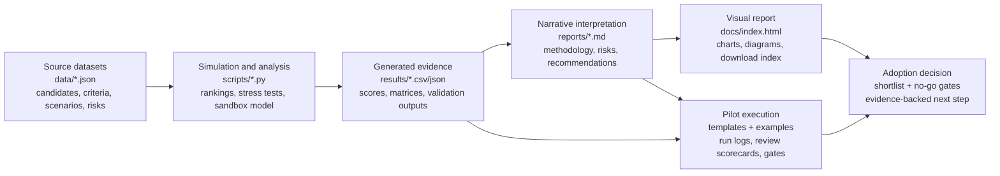
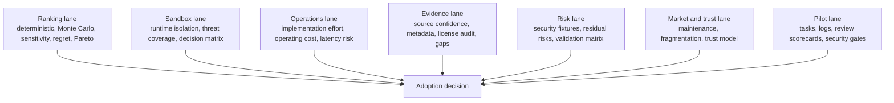

# Final Global Report: AI Orchestrators For SDLC

Date: 2026-07-07

This report consolidates the material collected in the repository into one coherent executive and technical narrative. The source evidence remains in `data/`, `results/`, `reports/`, `templates/`, and `scripts/`; this document explains how those pieces connect and what practical adoption decision they support.

## Global View

The main conclusion is that there is no universal winner. The right tool depends on the adoption scenario, the desired level of autonomy, the required human-control model, the tolerance for provider lock-in, the sandbox strategy, and the operating capacity of the team.

The analysis filters permissive open-source alternatives, scores them across 14 criteria, runs deterministic rankings and Monte Carlo simulations, checks sensitivity to weights, estimates implementation effort and operational cost, adds a dedicated sandboxing report, and ends with a pilot plan with security gates and no-go conditions.

The practical recommendation is to run a controlled two-week pilot with:

1. `OpenHands Software Agent SDK`
2. `Cline / Cline SDK`
3. `Deep Agents`
4. `Codex CLI` for secure autonomous PR work, or `mini-SWE-agent` if the main goal is reproducible benchmarking

The final adoption decision should depend on pilot evidence, not only on the simulated ranking.

## What Was Evaluated

The initial universe comes from a shared conversation about frameworks and tools for code-agent orchestration. The repository keeps only permissive open-source alternatives under MIT or Apache-2.0 and excludes closed or incompatible entries.

The evaluation covers:

- 17 included alternatives and 2 excluded alternatives.
- 14 scoring criteria on a 0-5 scale.
- 5 decision scenarios.
- 5,000 Monte Carlo trials for alternative rankings.
- 4,000 Monte Carlo trials for sandboxing.
- Stress tests for deterministic assumptions and uncertainty.
- Risk, evidence, maintenance, market, and trust analysis.
- Templates for running comparable pilots.

## Conceptual Model

The system is a chain of evidence:

`data/*.json` defines candidates, criteria, scenarios, risks, pilot tasks, and assumptions.
`scripts/*.py` transforms those inputs into reproducible outputs.
`results/*.csv` stores rankings, stability, costs, gaps, risks, and decision matrices.
`reports/*.md` interprets those results for executive, technical, and security audiences.
`templates/` and `examples/` turn the simulation into real pilot evidence.
`tests/` and `ci/` validate that the artifacts remain consistent.

For a complete visual map, see `reports/system_diagrams.md`.

## Visual Processing Map

The final report is organized for visual processing. The complete evidence path is:



The information is also grouped into decision lanes:



The same diagrams are rendered as SVG assets in the published GitHub Pages report:

- `docs/assets/final-report-evidence-pipeline.svg`
- `docs/assets/final-report-decision-lanes.svg`
- `docs/assets/final-report-artifact-coverage.svg`

Coverage summary:

| Artifact group | Count | Role in the final report |
|---|---:|---|
| Source JSON datasets in `data/` | 14 | Define candidates, criteria, scenarios, risks, sandboxes, assumptions, and traceability. |
| Generated result files in `results/` | 41 | Preserve every quantitative output, validation check, matrix, and generated decision signal. |
| Markdown reports and appendices in `reports/` | 40 | Provide narrative interpretation, methodology, operational guidance, risk analysis, and maintenance guidance. |
| Pilot templates and examples | 8 | Turn the simulated recommendation into comparable real-world evidence. |
| Validation scripts and tests | 60+ files | Keep the report reproducible and check generated artifacts before publication. |

## Methodology

The methodology combines multi-criteria decision analysis with reproducible validation:

1. Filter alternatives by permissive license.
2. Score alternatives against 14 criteria.
3. Apply scenario-specific weights.
4. Calculate deterministic rankings.
5. Perturb scores and weights with Monte Carlo to measure stability.
6. Review sensitivity, regret, Pareto frontier, and cross-scenario stability.
7. Adjust interpretation with implementation effort, operational cost, evidence, and risk.
8. Evaluate sandboxing as a separate decision layer.
9. Translate the shortlist into a pilot protocol and security gates.

The outputs are useful for reducing uncertainty before a pilot, but they do not replace tests on internal repositories.

## Scenario Findings

| Scenario | Simulated leader | Practical read |
|---|---|---|
| Custom orchestrator platform | `Cline / Cline SDK` by a minimal margin over `OpenHands SDK` | This is a close race; pilot both against `Deep Agents` before deciding. |
| Secure autonomous PRs | `Codex CLI` | Strong if OpenAI dependence is acceptable and sandboxing plus PR automation are priorities; compare with `OpenHands SDK` and `Cline`. |
| Quick local coding | `Cline / Cline SDK` | The most stable candidate for local developer productivity; `OpenCode` and `Aider` are useful lightweight benchmarks. |
| Research benchmarking | `mini-SWE-agent` | The best reproducible baseline; compare with `SWE-agent` and `OpenHands SDK` when fuller workflows are needed. |
| Enterprise control plane | `Cline / Cline SDK` | Leads the simulation, but the decision depends on multi-team governance, observability, and operational load. |

The cross-scenario stability signal matters more than a single first-place result. `OpenHands Software Agent SDK` appears in the top three across all scenarios, while `Cline / Cline SDK` appears in the top three in four of five scenarios. That combination suggests the main pilot should compare both.

## Candidate Readout

This section is aligned with `data/alternatives.json` and covers every included permissive open-source alternative, not only the shortlist. The scenario tables above explain which candidates lead under specific weighting profiles; this table explains how every candidate should be interpreted.

| Alternative | License / maturity / language | What it is | Strongest signals | Watch points | Role in the decision |
|---|---|---|---|---|---|
| `Sandcastle` | MIT / beta / TypeScript | TypeScript library for orchestrating coding agents in isolated sandboxes with branch and worktree strategies. | Sandbox isolation, coding fit, CI and PR workflows. | Observability and maturity. | Pilot only if isolated branch or worktree orchestration is a priority. |
| `Flue` | Apache-2.0 / beta / TypeScript | Programmable TypeScript agent harness with sessions, tools, skills, sandboxing, deployment targets, and observability adapters. | Provider portability, extensibility, deployment flexibility. | Maturity and human control. | Use when a product-specific TypeScript agent platform matters. |
| `Anchor` | MIT / alpha / JavaScript | Narrow review-harness and plugin-style project centered on Claude Code workflows. | Implementation ease, human control, coding fit. | Multi-agent capability and maturity. | Reference or watchlist item, not a primary platform candidate. |
| `Omnigent` | Apache-2.0 / alpha / Python | Meta-harness for orchestrating multiple coding-agent backends with policies, sandboxing, and collaboration. | Provider portability, human control, extensibility. | Maturity and implementation effort. | Alpha control-plane idea to monitor or prototype only behind clear risk gates. |
| `OmniAgent` | MIT / alpha / Python | Local multi-model AI coding agent CLI with ReAct, Plan-Execute, MCP, memory, and TUI concepts. | Provider portability, human control, implementation ease. | Maturity and CI or PR automation. | Experimental local CLI watchlist item. |
| `Omni Agent` | MIT / alpha / TypeScript | Verification-native local coding-agent runtime with eval gates, memory, subagents, and model profiles. | Security governance, provider portability, multi-agent design. | Maturity and research reproducibility. | Verification-design reference, not an adoption bet yet. |
| `Deep Agents` | MIT / beta / Python | Batteries-included agent harness with tools, filesystem, permissions, code execution, memory, subagents, and human-in-the-loop controls. | Provider portability, extensibility, persistence and memory. | CI or PR automation and maturity. | Strong Python orchestrator comparator for a head-to-head pilot. |
| `Codex CLI` | Apache-2.0 / production / Rust | OpenAI terminal coding agent with OS-level sandboxing, approvals, subagents, skills, hooks, and GitHub Action integration. | Security governance, coding fit, sandbox isolation. | Provider portability and persistence or memory. | Secure autonomous PR, local, or CI candidate if OpenAI dependence is acceptable. |
| `OpenCode` | MIT / production / TypeScript | Open-source coding agent for terminal, desktop, and IDE workflows with broad provider support. | Provider portability, coding fit, extensibility. | Sandbox isolation and observability. | Local provider-flexible benchmark and practical developer-experience comparator. |
| `Cline / Cline SDK` | Apache-2.0 / production / TypeScript | Autonomous coding agent delivered as SDK, IDE extension, CLI, and automation surface. | Human control, provider portability, extensibility. | Sandbox isolation and research reproducibility. | Primary workflow candidate for human-guided and control-plane scenarios. |
| `OpenHands Agent Canvas` | MIT / beta / TypeScript | Self-hosted developer control center for running coding agents and automations locally or in the cloud. | Provider portability, deployment flexibility, multi-agent operation. | Maturity and research reproducibility. | Control-center candidate when self-hosted UI and backend switching matter. |
| `OpenHands Software Agent SDK` | MIT / production / Python | Composable Python and REST SDK for building software-engineering agents with local or ephemeral workspaces. | Provider portability, coding fit, extensibility. | Implementation ease and observability. | Primary platform candidate and the most stable cross-scenario option. |
| `Open SWE` | MIT / beta / Python | Open-source asynchronous coding-agent framework built on Deep Agents and LangGraph, with cloud sandbox providers and automatic PR creation. | CI and PR automation, sandbox isolation, multi-agent operation. | Implementation ease and maturity. | Async PR platform candidate when autonomous internal coding-agent workflows are the goal. |
| `Aider` | Apache-2.0 / production / Python | Terminal pair-programming agent focused on Git-based code edits, repo maps, and broad model support. | Coding fit, implementation ease, provider portability. | Multi-agent capability and sandbox isolation. | Pair-programming baseline and fast trial candidate. |
| `goose` | Apache-2.0 / production / Rust | General-purpose local AI agent with desktop, CLI, API, MCP extensions, and broad provider support. | Provider portability, extensibility, implementation ease. | Multi-agent capability and observability. | General local automation and MCP benchmark, especially when work extends beyond code. |
| `SWE-agent` | MIT / production / Python | Research-grade and practical harness for solving real GitHub issues with a model of choice. | Research reproducibility, provider portability, coding fit. | Multi-agent capability and persistence or memory. | Research benchmark candidate and issue-resolution reference. |
| `mini-SWE-agent` | MIT / beta / Python | Minimal Python SWE agent for solving GitHub issues or command-line tasks, optimized for simplicity and benchmark reproducibility. | Research reproducibility, provider portability, implementation ease. | Multi-agent capability and persistence or memory. | Minimal reproducibility baseline for ablations and small experiments. |

### Excluded From The Permissive OSS Set

| Item | Reason |
|---|---|
| `Claude Agent SDK` | Not included in the permissive open-source shortlist. The shared table marked it as an official Anthropic license and Claude-centric, so it does not meet the requested permissive OSS filter. |
| `Codex app` | Not included because the shared table marked it as a closed or commercial desktop application, not an open-source framework. |

## Security And Sandboxing

The dedicated sandboxing report separates a critical question: what isolation model is appropriate for agents that execute code? The answer depends on whether the work is local development, autonomous PR work, untrusted user code, large-scale evaluations, or enterprise self-hosting.

| Sandbox scenario | Leading candidate | Implication |
|---|---|---|
| Local developer agents | `Flue virtual sandbox`, `Daytona`, and `Kubernetes hardened pods` are close | For local tasks, context and ergonomics can matter as much as hard isolation. |
| Autonomous PR security | `Daytona` | Managed sandboxes are strong if isolation, tenancy, secrets, and cost pass review. |
| Untrusted user code | `Daytona`, followed by `E2B` and `Modal` | Do not execute untrusted code without explicit boundary, network, and secret validation. |
| Evals and RL scale | `Daytona`, `Modal`, `E2B` | Managed scale matters more than local convenience. |
| Enterprise self-hosted | `Kubernetes hardened pods`, `Firecracker microVMs`, `Kata Containers` | Self-hosting requires platform capability and serious observability. |

Operational rule: do not confuse approvals or workflow conventions with hard isolation. Security gates must test prompt injection, workspace boundaries, secrets, network policy, and diff quality.

## Main Risks

The most important risks are not only technical:

- Prompt injection from issues, documentation, web pages, or tool output.
- Sandbox escapes or writes outside the workspace.
- Secret exposure through logs, prompts, or outputs.
- Network policies that are too broad.
- Public benchmark success that does not transfer to internal repositories.
- Alpha or beta API churn.
- Observability that is insufficient to reconstruct failures.
- Autonomous PRs that produce large or low-quality diffs.
- Model or provider lock-in.
- Cost and latency outside the operating envelope.

Each risk has required evidence and a pass condition in `results/risk_validation_matrix.csv`.

## Market, Maintenance, And Trust

The repository addenda show that AI-native creation lowers prototype cost, but shifts difficulty toward distribution, differentiation, support, security, and trust. Building fast does not guarantee a defensible product or a maintainable workflow.

The adoption decision should pass four gates:

1. The framework improves outcomes versus simple baselines.
2. The team can operate and maintain the stack.
3. The security model supports the desired autonomy level.
4. The resulting product or workflow is defensible and reviewable.

The trust matrix also warns that reading generated code does not scale without provenance, tests, focused diffs, and reconstructable decisions.

## Recommended Pilot Plan

Run a two-week pilot with representative and comparable tasks:

1. Select 3 or 4 candidates for the target scenario.
2. Execute tasks from `data/pilot_tasks.json`.
3. Log every run in `templates/pilot_run_log.csv`.
4. Review diffs with `templates/reviewer_scorecard.md`.
5. Apply gates from `templates/security_gate_checklist.md`.
6. Calculate the post-pilot decision with `scripts/score_pilot_results.py`.
7. Document no-go conditions in `reports/adoption_decision_record.md`.

The success criterion should not be only "the task passed." It should include human time, diff quality, traceability, security, cost, latency, reproducibility, and maintenance burden.

## Executive Recommendation

If the goal is to choose a general foundation for evolving a code-agent system, start with an `OpenHands SDK` vs `Cline SDK` vs `Deep Agents` pilot.
If the immediate goal is secure autonomous PR work, include `Codex CLI` and prioritize sandbox, secret, network, and approval gates.
If the goal is reproducible research, use `mini-SWE-agent` and `SWE-agent` as baselines before adopting broader tools.
If the goal is an enterprise control plane, do not adopt by ranking alone: first validate multi-team operation, observability, governance, and maintenance cost.

## Download The Data

Use these direct links to download the source datasets and generated result files:

| Dataset | Format | Direct download |
|---|---|---|
| Candidate dataset | JSON | [data/alternatives.json](https://raw.githubusercontent.com/gvillarroel/sdlc/main/data/alternatives.json) |
| Scoring rubric | JSON | [data/scoring_rubric.json](https://raw.githubusercontent.com/gvillarroel/sdlc/main/data/scoring_rubric.json) |
| Scenario profiles | JSON | [data/scenario_profiles.json](https://raw.githubusercontent.com/gvillarroel/sdlc/main/data/scenario_profiles.json) |
| Sandbox evaluation dataset | JSON | [data/sandbox_evaluation.json](https://raw.githubusercontent.com/gvillarroel/sdlc/main/data/sandbox_evaluation.json) |
| Pilot tasks | JSON | [data/pilot_tasks.json](https://raw.githubusercontent.com/gvillarroel/sdlc/main/data/pilot_tasks.json) |
| Risk register | JSON | [data/risk_register.json](https://raw.githubusercontent.com/gvillarroel/sdlc/main/data/risk_register.json) |
| Requirement traceability matrix | JSON | [data/traceability_matrix.json](https://raw.githubusercontent.com/gvillarroel/sdlc/main/data/traceability_matrix.json) |
| Market, maintenance, and trust sources | CSV | [data/sources/market_maintenance_source_matrix.csv](https://raw.githubusercontent.com/gvillarroel/sdlc/main/data/sources/market_maintenance_source_matrix.csv) |
| Complete generated output | JSON | [results/all_results.json](https://raw.githubusercontent.com/gvillarroel/sdlc/main/results/all_results.json) |
| Scenario shortlist | CSV | [results/decision_shortlist.csv](https://raw.githubusercontent.com/gvillarroel/sdlc/main/results/decision_shortlist.csv) |
| Deterministic rankings | CSV | [results/deterministic_rankings.csv](https://raw.githubusercontent.com/gvillarroel/sdlc/main/results/deterministic_rankings.csv) |
| Monte Carlo summary | CSV | [results/monte_carlo_summary.csv](https://raw.githubusercontent.com/gvillarroel/sdlc/main/results/monte_carlo_summary.csv) |
| Sandbox decision matrix | CSV | [results/sandbox_decision_matrix.csv](https://raw.githubusercontent.com/gvillarroel/sdlc/main/results/sandbox_decision_matrix.csv) |
| Risk validation matrix | CSV | [results/risk_validation_matrix.csv](https://raw.githubusercontent.com/gvillarroel/sdlc/main/results/risk_validation_matrix.csv) |
| Artifact manifest | CSV | [results/artifact_manifest.csv](https://raw.githubusercontent.com/gvillarroel/sdlc/main/results/artifact_manifest.csv) |

## Complete Data And Results Index

The final report uses all structured inputs and all generated result families. The complete machine-readable index is below.

### Source Datasets

| File | Direct download |
|---|---|
| `data/alternatives.json` | [download](https://raw.githubusercontent.com/gvillarroel/sdlc/main/data/alternatives.json) |
| `data/candidate_taxonomy.json` | [download](https://raw.githubusercontent.com/gvillarroel/sdlc/main/data/candidate_taxonomy.json) |
| `data/decision_tree.json` | [download](https://raw.githubusercontent.com/gvillarroel/sdlc/main/data/decision_tree.json) |
| `data/operational_cost_model.json` | [download](https://raw.githubusercontent.com/gvillarroel/sdlc/main/data/operational_cost_model.json) |
| `data/pilot_decision_model.json` | [download](https://raw.githubusercontent.com/gvillarroel/sdlc/main/data/pilot_decision_model.json) |
| `data/pilot_sample_size_model.json` | [download](https://raw.githubusercontent.com/gvillarroel/sdlc/main/data/pilot_sample_size_model.json) |
| `data/pilot_tasks.json` | [download](https://raw.githubusercontent.com/gvillarroel/sdlc/main/data/pilot_tasks.json) |
| `data/risk_register.json` | [download](https://raw.githubusercontent.com/gvillarroel/sdlc/main/data/risk_register.json) |
| `data/sandbox_evaluation.json` | [download](https://raw.githubusercontent.com/gvillarroel/sdlc/main/data/sandbox_evaluation.json) |
| `data/scenario_profiles.json` | [download](https://raw.githubusercontent.com/gvillarroel/sdlc/main/data/scenario_profiles.json) |
| `data/scoring_rubric.json` | [download](https://raw.githubusercontent.com/gvillarroel/sdlc/main/data/scoring_rubric.json) |
| `data/security_evaluation_fixtures.json` | [download](https://raw.githubusercontent.com/gvillarroel/sdlc/main/data/security_evaluation_fixtures.json) |
| `data/simulation_assumptions.json` | [download](https://raw.githubusercontent.com/gvillarroel/sdlc/main/data/simulation_assumptions.json) |
| `data/traceability_matrix.json` | [download](https://raw.githubusercontent.com/gvillarroel/sdlc/main/data/traceability_matrix.json) |
| `data/sources/market_maintenance_source_matrix.csv` | [download](https://raw.githubusercontent.com/gvillarroel/sdlc/main/data/sources/market_maintenance_source_matrix.csv) |

### Generated Results

| Result family | Files |
|---|---|
| Full machine output and manifest | `results/all_results.json`, `results/artifact_manifest.csv` |
| Base ranking and scenario fit | `results/deterministic_rankings.csv`, `results/monte_carlo_summary.csv`, `results/sensitivity_summary.csv`, `results/category_scores.csv`, `results/decision_shortlist.csv`, `results/scenario_weights.csv` |
| Stability and stress testing | `results/regret_analysis.csv`, `results/pareto_frontier.csv`, `results/rank_stability.csv`, `results/stress_test_summary.csv`, `results/stress_test_rankings.csv`, `results/uncertainty_stress_summary.csv`, `results/uncertainty_stress_details.csv` |
| Candidate explanation | `results/criteria_definitions.csv`, `results/evidence_matrix.csv`, `results/alternative_scorecards.csv`, `results/score_driver_summary.csv`, `results/criterion_spread_summary.csv` |
| Operational planning | `results/implementation_effort_estimates.csv`, `results/operational_cost_estimates.csv`, `results/operational_fit_rankings.csv` |
| Pilot planning | `results/scenario_playbook_summary.csv`, `results/pilot_sample_size_estimates.csv`, `results/pilot_decision_scores.example.csv`, `results/recommendation_rationale.csv` |
| Risk, evidence, and source checks | `results/evidence_gap_analysis.csv`, `results/risk_validation_matrix.csv`, `results/license_audit.csv`, `results/source_check.csv`, `results/github_metadata_check.csv` |
| Sandbox evaluation | `results/sandbox_deterministic_rankings.csv`, `results/sandbox_monte_carlo_summary.csv`, `results/sandbox_threat_coverage.csv`, `results/sandbox_decision_matrix.csv`, `results/sandbox_source_matrix.csv` |
| Repository QA | `results/local_artifact_reference_check.csv`, `results/markdown_table_check.csv`, `results/csv_schema_check.csv`, `results/custom_weights_example_rankings.csv` |

For direct download of any result file, use:

```text
https://raw.githubusercontent.com/gvillarroel/sdlc/main/results/<filename>
```

## Complete Report Library

The final report also incorporates the narrative and validation material from the report library:

| Report family | Files |
|---|---|
| Executive and final review | `reports/final_global_report.md`, `reports/executive_brief.md`, `reports/final_report_bundle.md`, `reports/release_notes.md`, `reports/README.md`, `reports/presentation_outline.md` |
| Core analysis | `reports/ai_orchestrator_frameworks_report.md`, `reports/methodology_appendix.md`, `reports/recommendation_rationale.md`, `reports/scenario_playbooks.md`, `reports/decision_tree.md`, `reports/candidate_taxonomy.md` |
| Visual and navigation support | `reports/system_diagrams.md`, `reports/results_data_dictionary.md`, `reports/glossary.md`, `reports/faq.md` |
| Security, sandbox, and risks | `reports/sandbox_report.md`, `reports/security_evaluation_fixtures.md`, `reports/risk_validation_matrix.md`, `reports/residual_risks.md`, `reports/evidence_gap_analysis.md`, `reports/github_metadata_check.md` |
| Market, maintenance, and trust | `reports/market_maintenance_synthesis.md`, `reports/market_entry_barriers_shift.md`, `reports/market_fragmentation_user_share.md`, `reports/long_term_ai_app_maintenance.md`, `reports/ai_code_trust_matrix.md`, `reports/maintenance_guide.md` |
| Pilot and operations | `reports/pilot_protocol.md`, `reports/pilot_sample_size.md`, `reports/implementation_blueprints.md`, `reports/operational_cost_model.md`, `reports/adoption_decision_record.md` |
| Scope and validation | `reports/exclusions.md`, `reports/environment_prerequisites.md`, `reports/requirements_traceability.md`, `reports/validation_summary.md`, `reports/simulation_assumptions.md`, `reports/score_driver_summary.md` |

## Traceability

| Need | Source artifact |
|---|---|
| Navigate all deliverables | `reports/README.md` |
| Understand connections between tools and concepts | `reports/system_diagrams.md` |
| Review methodology | `reports/methodology_appendix.md` |
| Review the main report | `reports/ai_orchestrator_frameworks_report.md` |
| Review sandboxing | `reports/sandbox_report.md` |
| Review market, maintenance, and trust | `reports/market_maintenance_synthesis.md` |
| Review residual risks | `reports/residual_risks.md` |
| Run maintenance | `reports/maintenance_guide.md` |
| Validate everything locally | `python scripts/run_all_checks.py` |

## Publication Status

The web version of this report is published from `docs/index.html` via GitHub Pages using the `main` / `docs` source.
