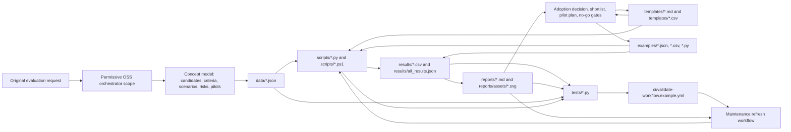
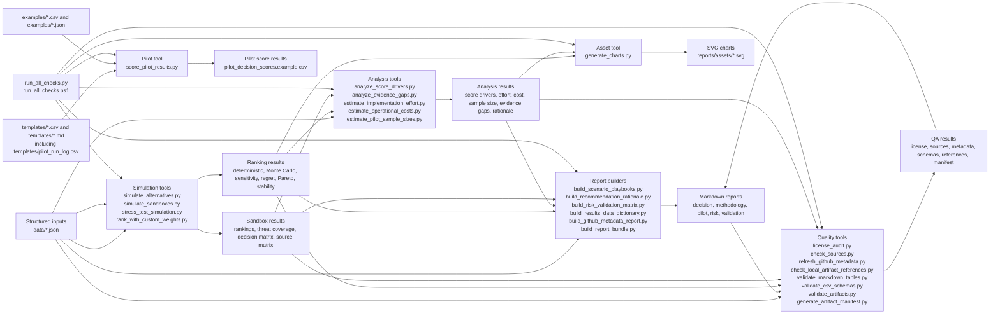
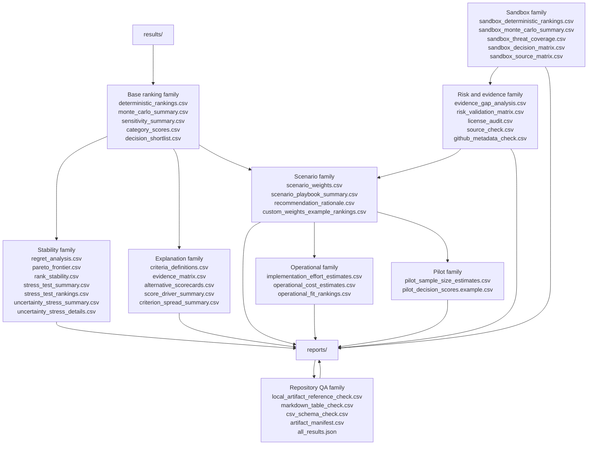
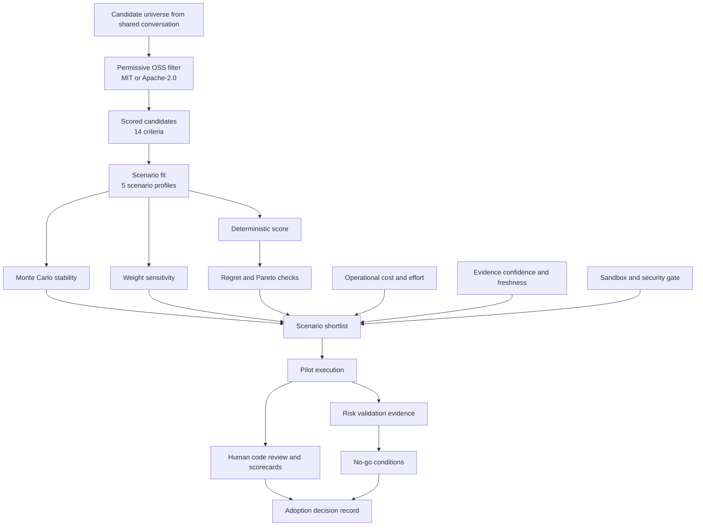
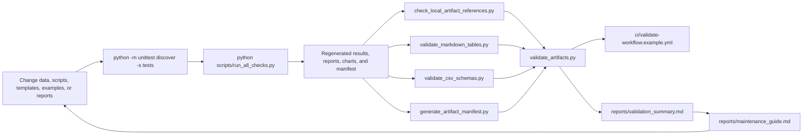

# System Diagrams

Date: 2026-07-06

These diagrams connect the repository concepts, tools, generated artifacts, and validation loops. Read every arrow as "feeds", "generates", "validates", or "informs" depending on the label.

## 1. Full Connected Map

This is the highest-level map: every repository area connects back to the same decision evidence loop.

## 2. Data And Concept Model

The core concepts are stored as structured JSON first, then transformed into rankings, diagnostics, reports, and pilot evidence.

```mermaid
flowchart TD
    Alternatives["data/alternatives.json<br/>17 included alternatives<br/>2 excluded alternatives"]
    Criteria["14 scoring criteria<br/>0-5 rubric"]
    Rubric["data/scoring_rubric.json<br/>score anchors"]
    Scenarios["data/scenario_profiles.json<br/>5 decision scenarios"]
    Weights["scenario weights<br/>generated in results/scenario_weights.csv"]
    Sandbox["data/sandbox_evaluation.json<br/>sandbox candidates, scenarios, threats"]
    Risks["data/risk_register.json<br/>adoption risks and mitigations"]
    Assumptions["data/simulation_assumptions.json<br/>validity threats and stress tests"]
    Cost["data/operational_cost_model.json<br/>operating profiles"]
    PilotTasks["data/pilot_tasks.json<br/>20 pilot tasks"]
    PilotDecision["data/pilot_decision_model.json<br/>post-pilot gates and weights"]
    SampleSize["data/pilot_sample_size_model.json<br/>task-count assumptions"]
    Taxonomy["data/candidate_taxonomy.json<br/>adoption-shape groups"]
    Traceability["data/traceability_matrix.json<br/>requirements to artifacts"]
    Fixtures["data/security_evaluation_fixtures.json<br/>security gate cases"]

    Alternatives --> Criteria
    Rubric --> Criteria
    Criteria --> Weights
    Scenarios --> Weights
    Weights --> Rankings["scenario rankings and shortlists"]
    Alternatives --> Rankings
    Assumptions --> Rankings
    Sandbox --> SandboxRankings["sandbox rankings and threat coverage"]
    Risks --> RiskMatrix["risk validation matrix"]
    Fixtures --> RiskMatrix
    Cost --> OperationalFit["operational cost and adjusted rankings"]
    PilotTasks --> PilotProtocol["pilot protocol and templates"]
    SampleSize --> PilotProtocol
    PilotDecision --> PilotProtocol
    Taxonomy --> Reports["taxonomy, brief, decision reports"]
    Traceability --> Validation["traceability and validation summary"]
    Rankings --> Reports
    SandboxRankings --> Reports
    RiskMatrix --> Reports
    OperationalFit --> Reports
    PilotProtocol --> Reports
```

## 3. Tool Pipeline

The scripts are grouped by job so the workflow is easier to follow without losing connectivity.

## 4. Result Families

The generated `results/` directory is not one flat pile; it has connected families that answer different decision questions.

## 5. Decision Flow

This diagram connects the concepts a reviewer uses to move from static research to a real adoption decision.

## 6. Validation And Maintenance Loop

The repository is designed so generated artifacts can be refreshed and checked as a repeatable local or CI workflow.

## 7. Script-To-Artifact Index

| Tool | Primary input | Primary output |
|---|---|---|
| `scripts/simulate_alternatives.py` | `data/alternatives.json` and scenario weights | Base rankings, Monte Carlo, sensitivity, category scores, shortlist, `results/all_results.json` |
| `scripts/simulate_sandboxes.py` | `data/sandbox_evaluation.json` | Sandbox rankings, threat coverage, decision matrix, sandbox report |
| `scripts/stress_test_simulation.py` | `data/alternatives.json`, `data/simulation_assumptions.json` | Deterministic and uncertainty stress-test CSVs |
| `scripts/analyze_score_drivers.py` | Rankings and candidate scores | Score-driver and criterion-spread CSVs/report inputs |
| `scripts/build_scenario_playbooks.py` | Scenario outputs and shortlists | Scenario playbook CSV/report |
| `scripts/estimate_implementation_effort.py` | Candidate scores | Prototype and hardening effort estimates |
| `scripts/estimate_operational_costs.py` | `data/operational_cost_model.json` and rankings | Operational cost and adjusted ranking CSVs/report |
| `scripts/estimate_pilot_sample_sizes.py` | `data/pilot_sample_size_model.json` and shortlist comparisons | Pilot sample-size estimates/report |
| `scripts/analyze_evidence_gaps.py` | Candidate metadata and evidence confidence | Evidence gap CSV/report |
| `scripts/build_recommendation_rationale.py` | Rankings, risks, effort, cost, stability | Scenario recommendation rationale CSV/report |
| `scripts/build_risk_validation_matrix.py` | `data/risk_register.json` and security fixtures | Risk validation matrix CSV/report |
| `scripts/rank_with_custom_weights.py` | `examples/custom_weights.example.json` | Custom-weight ranking CSV |
| `scripts/license_audit.py` | Candidate license data | License audit CSV |
| `scripts/check_sources.py` | Evidence URLs | Source health CSV |
| `scripts/refresh_github_metadata.py` | GitHub repository metadata | GitHub metadata CSV |
| `scripts/build_github_metadata_report.py` | `results/github_metadata_check.csv` | GitHub metadata Markdown report |
| `scripts/check_local_artifact_references.py` | README and reports | Local artifact reference CSV |
| `scripts/validate_markdown_tables.py` | README and reports | Markdown table consistency CSV |
| `scripts/validate_csv_schemas.py` | Generated CSVs | CSV schema check CSV |
| `scripts/generate_artifact_manifest.py` | Repository artifacts | SHA-256 artifact manifest |
| `scripts/validate_artifacts.py` | Generated results, reports, local QA CSVs | Offline artifact validation |
| `scripts/generate_charts.py` | Ranking and operational CSVs | SVG charts in `reports/assets/` |
| `scripts/build_results_data_dictionary.py` | Generated CSV schemas | Results data dictionary report |
| `scripts/build_report_bundle.py` | Main reports and appendices | One-file final report bundle |
| `scripts/score_pilot_results.py` | Pilot candidate summary CSV | Post-pilot decision scores |
| `scripts/run_all_checks.py` | Whole repository | End-to-end regeneration and validation |
| `scripts/run_all_checks.ps1` | PowerShell shell entrypoint | Calls `scripts/run_all_checks.py` |

## 8. Where To Start

| Need | Start here | Then follow |
|---|---|---|
| Understand the whole system | This file | `reports/artifact_index.md`, then `reports/final_report_bundle.md` |
| Decide what to pilot | `reports/executive_brief.md` | `reports/recommendation_rationale.md`, `reports/scenario_playbooks.md`, `reports/pilot_protocol.md` |
| Audit methodology | `reports/methodology_appendix.md` | `reports/simulation_assumptions.md`, `reports/score_driver_summary.md` |
| Review safety | `reports/sandbox_report.md` | `reports/security_evaluation_fixtures.md`, `reports/risk_validation_matrix.md` |
| Refresh outputs | `reports/maintenance_guide.md` | `python scripts/run_all_checks.py` |
